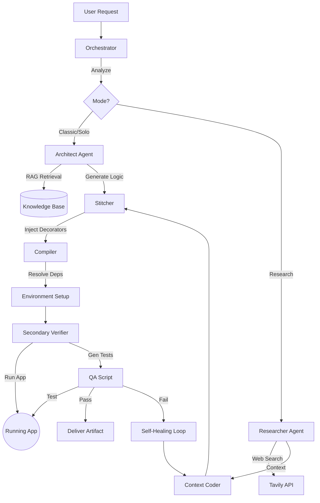

<div align="center">
  
  <h1>Dev0: AI-Powered Modular Development Platform</h1>
</div>

<div align="center">


</div>

**Dev0** is a self-developing, low-code/no-code platform designed as a sandbox for building applications using modular components. It leverages a multi-agent AI architecture to generate, compile, and execute complex software "recipes" from high-level user tasks.

---

## 📖 Table of Contents
- [Introduction](#-introduction)
- [Key Features](#-key-features)
- [System Architecture](#-system-architecture)
- [Getting Started](#-getting-started)
- [Usage Guide](#-usage-guide)
- [Project Structure](#-project-structure)
- [Documentation](#-documentation)

---

## 🌟 Introduction
Dev0 is not just an auto-coder; it's a **"Glass Box" factory** where every step of the software creation process is observable, modular, and self-correcting. By combining specialized AI agents (Architects, Engineers, Testers) with a robust engineering framework, Dev0 can:
1.  **Plan** complex architectures.
2.  **Generate** pure business logic.
3.  **Stitch** reliability and observability decorators automatically.
4.  **Verify** code with generated functional tests against a live server.

---

## 🚀 Key Features

### 1. "Glass Box" Observability
Unlike "Black Box" agents, Dev0 is transparent.
*   **Event Bus (Redis):** Every agent thought and action is published in real-time.
*   **Trace Trees:** Visualize the entire execution flow.
*   **Admin UI:** Monitor the system state via a web interface.

### 2. Multi-Mode Operation
*   **SOLO Mode (Classic):** Rapid assembly of applications using existing modules (Atomic Blocks) from the Knowledge Base.
*   **TEAM Mode (Research):** Creation of brand-new tools using web search (`Tavily`) and self-healing loops.
*   **Expert Intervention:** Automatic fallback to stronger models (Gemini 2.5/3.0) when weaker models fail.

### 3. Verification-Driven Development (VDD)
Dev0 doesn't just write code; it ensures it works.
*   **Runtime Analysis:** Attempts to start the generated application.
*   **QA Layer:** The `SecondaryVerifier` agent writes and executes functional tests (`pytest`/`httpx`) against the running app to validate the User Acceptance Criteria.

---

## 🏗 System Architecture

The system operates as a pipeline managed by an **Orchestrator**.



---

## ⚡ Getting Started

### Prerequisites
*   **Docker** & **Docker Compose**
*   **Python 3.12+** (for local scripts)
*   **Poetry**

### Installation

1.  **Clone the repository:**
    ```bash
    git clone https://github.com/your-repo/dev0.git
    cd dev0
    ```

2.  **Run the Installer:**
    This script sets up the environment, builds containers, and generates security credentials.
    ```bash
    # Linux / macOS
    ./install.sh

    # Windows
    install.bat
    ```

3.  **Configure API Keys:**
    Create `.env.<provider>` files in the root directory:
    *   `.env.google`: `GOOGLE_API_KEY=...`
    *   `.env.tavily`: `TAVILY_API_KEY=...`
    *   `.env.mistral`: `MISTRAL_API_KEY=...`

4.  **Start the System:**
    ```bash
    # Linux / macOS
    ./start.sh

    # Windows
    start.bat
    ```
    This launches Nginx, the App Server, Redis, and Qdrant.

5.  **Index the Knowledge Base:**
    ```bash
    ./scripts/reindex.sh
    ```

---

## 🎮 Usage Guide

### Using the CLI
You can interact with the system via the `run_orchestrator.py` script (if running locally) or via the API.

```bash
poetry run python run_orchestrator.py "Create a FastAPI app that converts Markdown to HTML"
```

### Accessing the Admin UI
Open `http://localhost/admin/` in your browser. (Credentials generated during install).

---

## 📂 Project Structure

```text
.
├── docs/               # Documentation
├── project/
│   ├── core/           # Framework (Orchestrator, Gateway, Memory)
│   ├── modules/        # Atomic Tools (Filesystem, etc.)
│   ├── recipes/        # Composite Agent Recipes
│   ├── tests/          # Unit Tests
├── scripts/            # Helper Scripts (Install, Backup, Index)
├── tests/              # Integration Tests
├── docker-compose.yml  # Container Orchestration
└── pyproject.toml      # Dependencies
```

---

## 📚 Documentation
For detailed information, please refer to the `docs/` directory:
*   [**Architecture Overview**](docs/1_architecture.md)
*   [**Developer Guide**](docs/2_developer_guide.md)
*   [**Agent Workflows**](docs/3_agent_workflows.md)
*   [**TypeScript Contracts**](docs/4_typescript_contracts.md)
*   [**Meta-Framework (Decorators)**](docs/5_decorators.md)

---

## 🛠 Roadmap
*   [x] **Code RAG:** Intelligence from codebase.
*   [x] **Verification Layer:** Automated functional testing.
*   [ ] **Frontend Integration:** Stitch/Jules integration.
*   [ ] **Advanced Self-Healing:** Iterative fix loops for logic errors.

---

## 📞 Contact & License

**License:** This project is licensed under the **GNU Affero General Public License v3.0 (AGPL-3.0)**. See the `LICENSE` file for details.

**Contact:**
*   **Telegram:** [@Lotargo](https://t.me/Lotargo)
