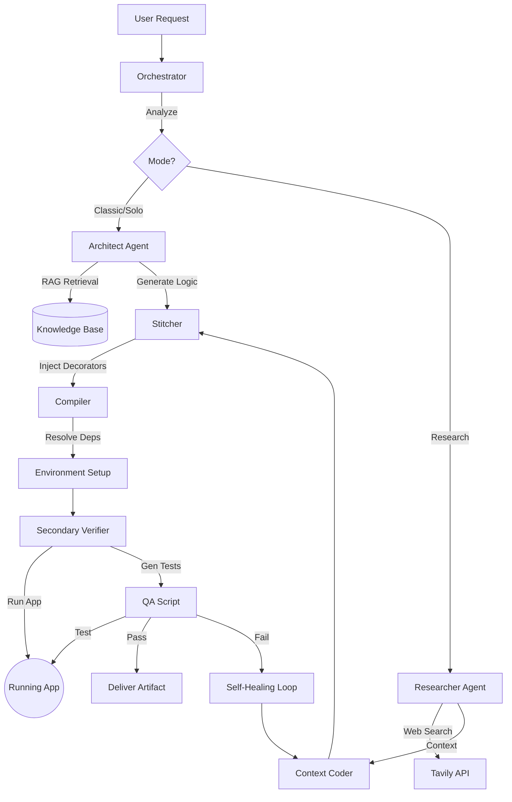

# Dev0 System Architecture

## 1. Overview
Dev0 is a self-evolving software development platform that leverages a multi-agent AI system to transform high-level user tasks into functioning code. The core philosophy is **"Intelligence from Structure"**, achieving complex results using specialized "weak" models orchestrated by a robust engineering framework.

## 2. The "Glass Box" Philosophy
Unlike traditional "Black Box" AI systems, Dev0 is built for complete transparency.
*   **Event Bus (Redis):** The central nervous system. All agent "thoughts" (Chain of Thought), actions, and state changes are published here.
*   **Trace Tree:** A hierarchical visualization of the execution flow (Orchestrator -> Architect -> Compiler).
*   **Observability:** Using the `@observable` decorator, every function call is traced with Start, Complete, and Error events, allowing real-time monitoring via the Admin UI.

## 3. Core Components

### 3.1. The Orchestrator
The central manager (`run_orchestrator.py`) that decides **HOW** to solve a task.
*   **Routing:** Determines if a task needs **SOLO** (Assembly) or **TEAM** (Research) mode.
*   **State Management:** Tracks the lifecycle of the request.

### 3.2. The Pipeline (Factory)
The code generation process follows a strict assembly line:
1.  **Architect:** Generates "Pure Code" logic (business logic only).
2.  **Stitcher:** Analyzes the code and injects necessary decorators (`@safe_call`, `@observable`) and imports.
3.  **Compiler:** Resolves dependencies (creating `pyproject.toml`), structures the file system, and prepares the environment.
4.  **Verifier:** Performs Static Analysis (AST checks) and Runtime Analysis (trying to start the app).
5.  **QA Layer:** Generates and runs functional tests (`qa_verify.py`) against the running application.

### 3.3. Memory & Knowledge Base (RAG)
*   **Qdrant:** Stores vector embeddings of:
    *   **Modules:** Atomic tools available for reuse.
    *   **Experiences:** Lessons learned from previous successes/failures.
    *   **Codebase:** Index of the current project code for context.

## 4. Diagram

