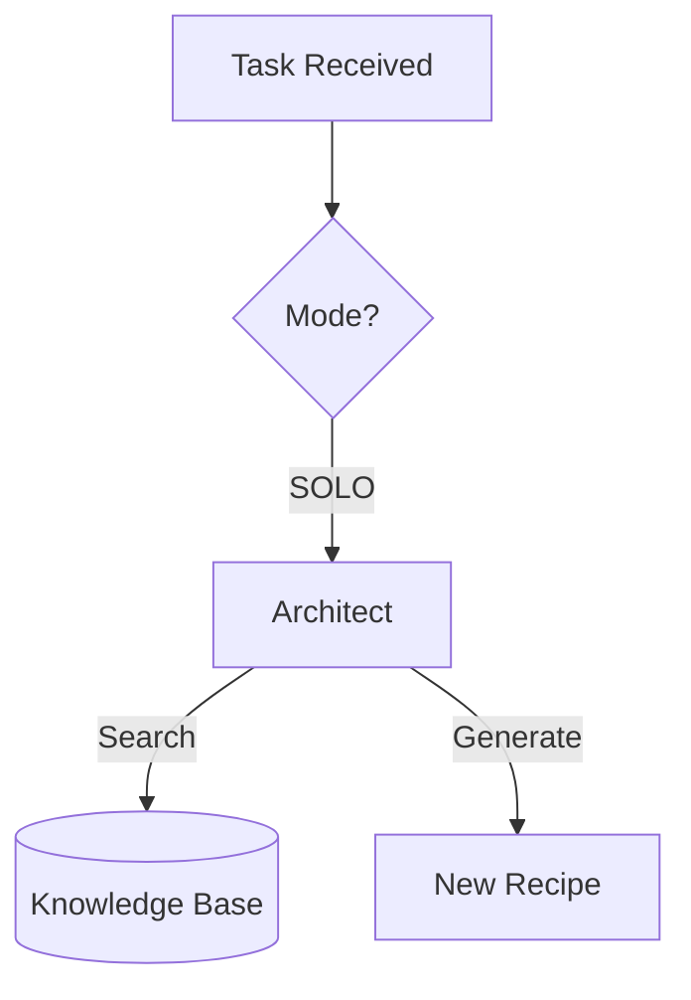
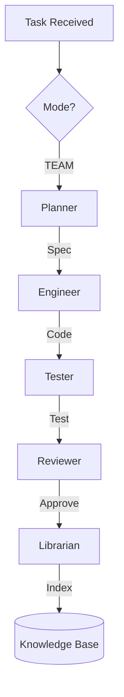

# AI Agents & Workflows

The Dev0 platform is driven by a team of autonomous AI agents. Their collaboration is coordinated by the **Orchestrator**, which selects the optimal operating mode based on the task.

## 1. The Team

-   **Orchestrator (`Orchestrator`):** The "Team Lead". Analyzes the task, selects the mode (`SOLO` or `TEAM`), and manages the workflow.
-   **Architect (`Architect`):** The "Builder". specializes in **combining existing tools**. It searches the Knowledge Base for relevant modules and assembles them into new recipes.
-   **Planner (`Planner`):** The "System Analyst". Analyzes the task to determine if existing tools are sufficient. If not, it creates a detailed plan for creating a new module.
-   **Engineer (`Engineer`):** The "Developer". Receives the plan from the Planner and writes the code for the new module.
-   **Tester (`Tester`):** The "QA Engineer". Writes `pytest` suites to verify the new module.
-   **Reviewer (`Reviewer`):** The "Tech Lead". Reviews code and tests for quality and standards.
-   **Librarian (`Librarian`):** The "Memory Manager". Indexes successful modules and lessons learned into the Vector DB.

## 2. Operating Modes

### 2.1. SOLO Mode (Classic / Assembly)
Used when the task can be solved by **combining existing tools**.

**Process:**
1.  **Task:** Orchestrator receives a request.
2.  **Route:** Dispatches to **Architect**.
3.  **Retrieval:** Architect queries `modules_db.json` and Qdrant.
4.  **Generation:** Architect generates a recipe using the retrieved tools.
5.  **Output:** A new functional recipe.

### 2.2. TEAM Mode (Research / Creation)
Used when **new functionality** is required.

**Process:**
1.  **Task:** Orchestrator dispatches to **Planner**.
2.  **Plan:** Planner creates a spec for a new atomic module.
3.  **Code:** **Engineer** implements the module.
4.  **Verify:** **Tester** creates tests; **Reviewer** approves.
5.  **Index:** **Librarian** saves the new module to the Knowledge Base.

### 2.3. Research Mode (Search-Driven)
Used for complex tasks requiring external libraries or fresh information.

*   **Agents:** `Researcher`, `ContextCoder`.
*   **Workflow:**
    1.  **Researcher** uses Tavily API to find documentation/libraries.
    2.  **ContextCoder** writes code based on search results.
    3.  **Execution:** Code is run.
    4.  **Self-Healing:** If it fails, the error is fed back to Researcher/Coder for a fix.
