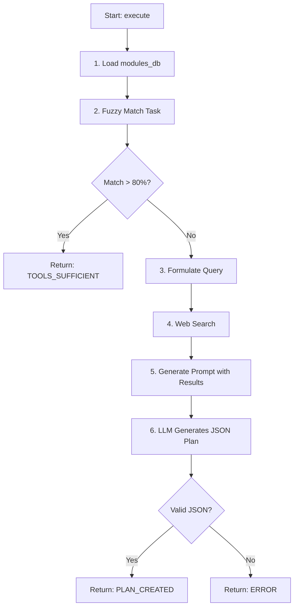

# Agent: Planner

## Role in the Team
The **Planner** is the "System Analyst". Its key task is to determine if the user task can be solved with existing tools or requires a new module. If new development is needed, it conducts research and creates a detailed technical plan.

## Core Logic

1.  **Tool Sufficiency Analysis:**
    *   Loads `modules_db.json`.
    *   Uses fuzzy search (`rapidfuzz`) to match the user task against existing tool descriptions.
    *   If a match > 80% is found, returns `TOOLS_SUFFICIENT`.

2.  **Research:**
    *   If tools are insufficient, it formulates a search query (e.g., "How to implement X in Python").
    *   Calls `web_search` (DuckDuckGo/Tavily) to get top 5 results.

3.  **Plan Creation:**
    *   Feeds search results and user task to the LLM.
    *   Requests a **Detailed Development Plan** in JSON format:
        *   `description`: Module description.
        *   `new_modules`: List of modules to create.
            *   `module_name`: Filename.
            *   `dependencies`: Pip packages.
            *   `pydantic_models`: Input/Output schemas.
            *   `implementation_details`: Step-by-step logic.

4.  **Return Result:**
    *   Returns `PLAN_CREATED` with the JSON plan.
    *   Returns `ERROR` on failure.

## Process Diagram

