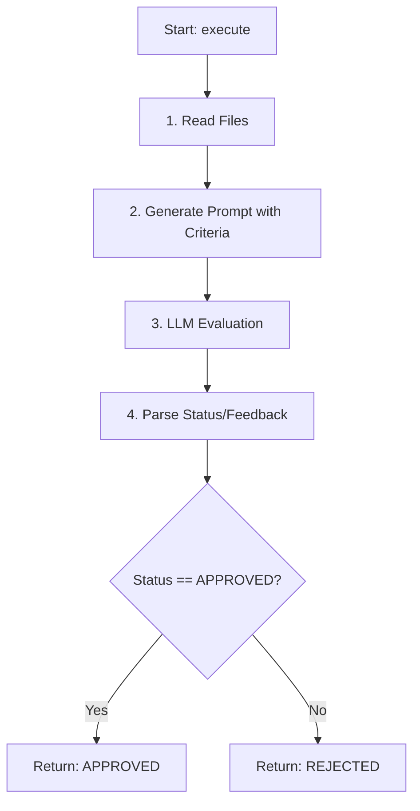

# Agent: Reviewer

## Role in the Team
The **Reviewer** is the "QA" or "Code Reviewer". It performs a static quality assessment of the code generated by the Engineer *after* it has passed automated tests.

It focuses on long-term maintainability: code cleanliness, documentation, and best practices.

## Core Logic

1.  **Read Code:** Reads the module and test files.
2.  **Generate Prompt:**
    *   Inserts code into an LLM prompt with specific **Evaluation Criteria**:
        1.  **Reusability:** No hardcoded values, logic separation.
        2.  **Pydantic Usage:** Correct validation models.
        3.  **Documentation:** Clear docstrings.
    *   **Strict Output Format:** Must start with `APPROVED` or `REJECTED` followed by feedback.
3.  **LLM Call:** Gets the evaluation.
4.  **Parse Response:**
    *   Extracts status (first line).
    *   If status is ambiguous, defaults to `REJECTED`.
    *   Extracts feedback (rest of the text).
5.  **Return Result:** Returns status and feedback to the Orchestrator.

## Process Diagram

